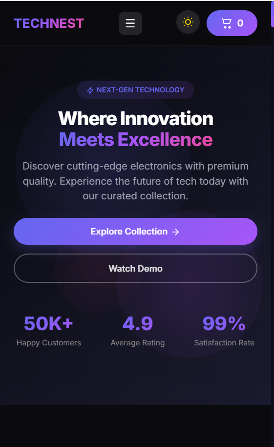
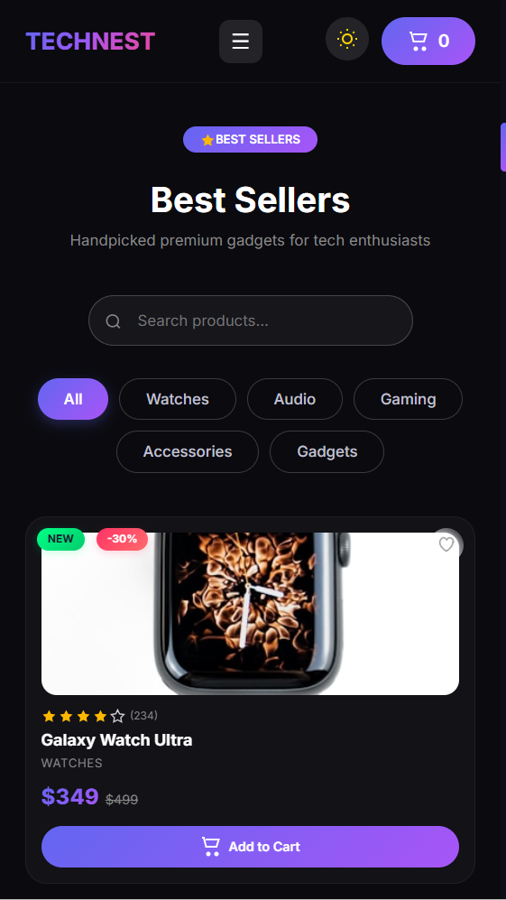
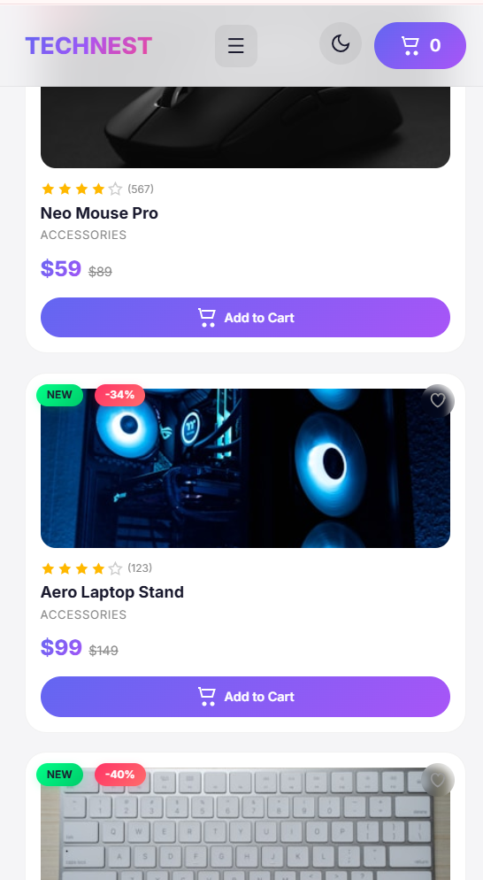
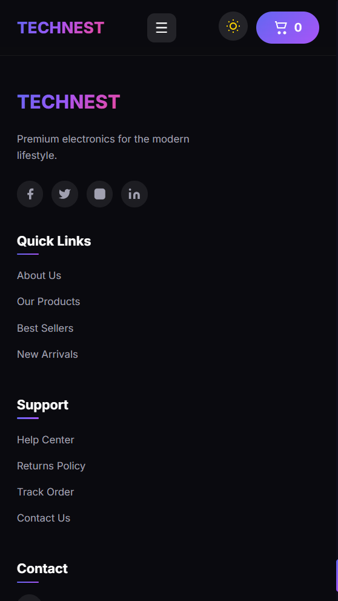

<div align="center">

# 🛍️ TechNest — Premium React E-Commerce Store

**A modern, fully responsive e-commerce web app with glassmorphism UI, dark/light mode, and a seamless shopping experience.**


[Features](#-features) • [Screenshots](#-screenshots-gallery) • [Tech Stack](#️-tech-stack) • [Installation](#-installation) • [Usage](#-usage) • [Author](#-author)

</div>

---

## 📖 About The Project

**TechNest** is a sleek, full-featured e-commerce storefront built to showcase modern frontend engineering with **React 19** and **Vite**. It combines a premium glassmorphism aesthetic with real-world shopping features — search & filtering, cart & wishlist management, checkout flow, and a persistent dark/light theme — all wrapped in a fully responsive layout that works beautifully across mobile, tablet, and desktop.

---
## 🖼️ Screenshots Gallery
## Home Page 


---
## Best Sellers


---

## Hot Deals 


---

## Testimonials


---
## Why Choose us 


---

## Footer


---
## Cart

<table>
<tr>
<td align="center"></td>
<td align="center"></td>
</tr>
</table>

---
## Responsiveness (Mobile Friendly)

<table>
<tr>
<td align="center"></td>
<td align="center"></td>
<td align="center"></td>
<td align="center"></td>
</tr>
</table>

## Features

### 🛍️ E-Commerce Core
- Product catalog with 15+ products across 6 categories
- Add to cart with quantity management
- Remove from cart with quantity controls
- Wishlist functionality (save favorite products)
- Cart drawer with real-time price calculation
- Local storage persistence (cart, wishlist, theme)

### 🔍 Search & Filter
- Real-time product search by name
- Category filters (All, Watches, Audio, Gaming, Accessories, Gadgets)
- Hot Deals section (automatically shows products with 30%+ discount)

### 🎨 UI/UX
- Glassmorphism design with backdrop blur
- Dark/Light mode toggle (persists in localStorage)
- Fully responsive across mobile, tablet & desktop
- Smooth animations (scroll reveal, hover effects, card lift)
- Custom animated cursor
- Floating background shapes
- Back to top button
- Toast notifications for order success

### 💳 Checkout
- Checkout form with validation (name, email, address)
- Auto-generated order ID
- Success modal with order confirmation
- Cart automatically clears after order

---


## 🛠️ Tech Stack

| Technology | Purpose |
|------------|---------|
| React 19 | Frontend framework |
| Vite | Build tool & dev server |
| JavaScript (ES6+) | Core logic |
| CSS3 | Styling & animations (glassmorphism) |
| Bootstrap 5 | Layout & responsive utilities |
| React Icons | Icon library |
| Framer Motion | Animations & custom cursor |
| React Toastify | Toast notifications |
| LocalStorage | Data persistence (cart, wishlist, theme) |

---

## 📁 Project Structure

```
tech-nest-store/
├── public/
│   └── images/                 # Screenshot & UI assets
├── src/
│   ├── components/
│   │   ├── Navbar.jsx          # Sticky navigation bar
│   │   ├── Hero.jsx            # Hero section with animated stats
│   │   ├── Features.jsx        # Features section
│   │   ├── ProductCard.jsx     # Individual product card
│   │   ├── ProductList.jsx     # Product grid with search & filters
│   │   ├── Testimonials.jsx    # Customer reviews
│   │   ├── Newsletter.jsx      # Email subscription
│   │   ├── Footer.jsx          # Footer with social links
│   │   ├── CartDrawer.jsx      # Shopping cart drawer & checkout
│   │   ├── CustomCursor.jsx    # Animated cursor
│   │   ├── ThemeToggle.jsx     # Dark/Light mode toggle
│   │   ├── FloatingShapes.jsx  # Animated background shapes
│   │   └── Icons.jsx           # All SVG icons
│   ├── data/
│   │   └── products.js         # Product data
│   ├── App.jsx                 # Main application
│   ├── main.jsx                # Entry point
│   └── index.css               # Global styles
├── index.html
├── package.json
└── README.md
```

---

## 🚀 Installation

```bash
# Clone the repository
git clone https://github.com/Sara12-2/TechNest_Ecommerce_Website

# Navigate to project
cd TechNest_Ecommerce_Website/tech-nest-store

# Install dependencies
npm install

# Start development server
npm run dev

# Open browser at http://localhost:5173
```

Other available scripts:

```bash
npm run build     # Production build
npm run preview   # Preview production build locally
npm run lint      # Run ESLint
```

---

## 📱 Usage

### 🛒 Cart System
- Browse products in the Best Sellers section
- Click **Add to Cart** on any product
- Cart count updates live in the navbar

### 🧺 Managing Cart
- Open the cart drawer from the navbar
- Increase / decrease item quantity
- Remove items
- Proceed to checkout

### 💳 Checkout
- Fill in name, email & address
- Click **Place Order**
- Order confirmation appears with an auto-generated order ID
- Cart clears automatically

### ❤️ Wishlist
- Click the heart icon on any product to save it
- Click again to remove

### 🌙 Dark / Light Mode
- Toggle from the navbar
- Preference is saved in localStorage

---

## 🧩 Components

| Component | Description |
|-----------|-------------|
| `Navbar` | Sticky navigation + cart + theme toggle |
| `Hero` | Animated landing section with stats |
| `Features` | Feature highlights section |
| `ProductCard` | Product UI with badges (New / Discount) |
| `ProductList` | Search + category filter system |
| `Testimonials` | Customer reviews carousel |
| `Newsletter` | Email subscription form |
| `Footer` | Links, contact info & socials |
| `CartDrawer` | Cart management + checkout flow |
| `CustomCursor` | Animated custom cursor |
| `ThemeToggle` | Dark/Light mode switcher |
| `FloatingShapes` | Decorative animated background shapes |

---

## 🎨 Customization

### ➕ Add a Product

Add a new entry to `src/data/products.js`:

```javascript
{
  id: 18,
  name: "Product Name",
  price: 99,
  oldPrice: 149,
  category: "Category",
  image: "image-url",
  rating: 4.5,
  reviews: 100,
  isNew: true,
  discount: 30
}
```

### 🌈 Change Theme Colors

Update the gradient variables in `src/index.css`:

```css
.gradient-primary {
  background: linear-gradient(135deg, #6366f1, #a855f7);
}
```

---

## 👩‍💻 Author

**Sara Manzoor**

[](https://github.com/Sara12-2)
[](https://www.linkedin.com/in/sara-manzoor-3a8a56365?utm_source=share_via&utm_content=profile&utm_medium=member_android)
[](mailto:saramanzoor76@gmail.com)

---

## 📄 License

Distributed under the **MIT License** — free to use and modify.

---

<div align="center">

## ⭐ Support

If you like this project, consider giving it a ⭐ on GitHub — it helps a lot!

**Built with ❤️ by Sara Manzoor**

</div>
