#  TechNest – Premium React E-Commerce Website


A modern, fully responsive e-commerce web application built with **React.js** and **Vite**. TechNest offers a premium shopping experience with glassmorphism UI, dark/light mode, shopping cart, wishlist, and seamless checkout flow.

# TechNest Store

## Screenshots Gallery

### Home Page
**Dark Theme**
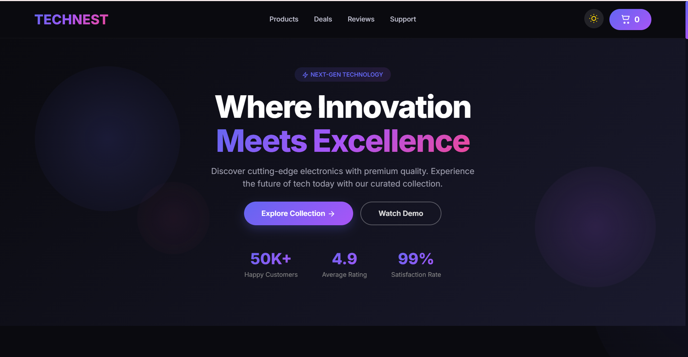

**Light Theme**
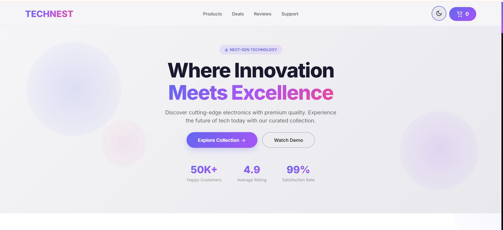

---

### Footer
**Dark Theme**
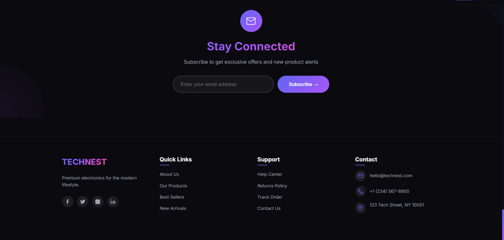

**Light Theme**
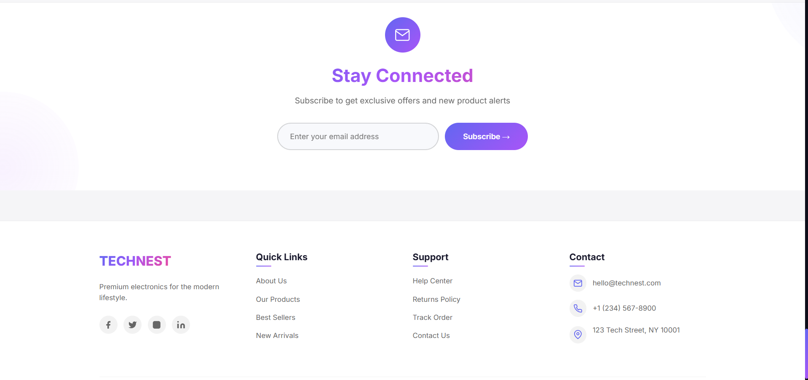

---

### Best Sellers
**Dark Theme 1**
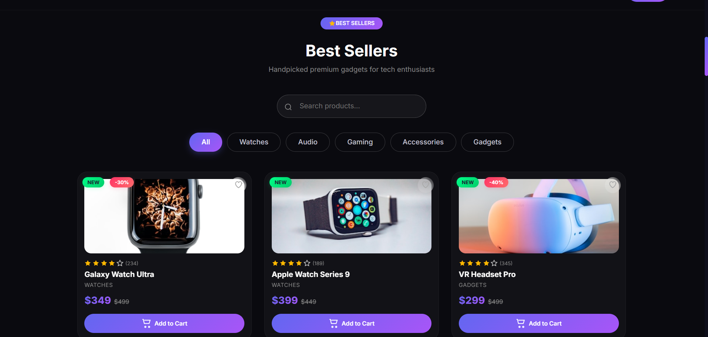

**Light Theme 1**
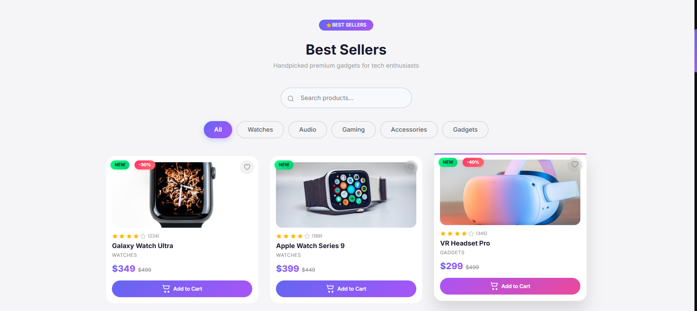

**Dark Theme 2**
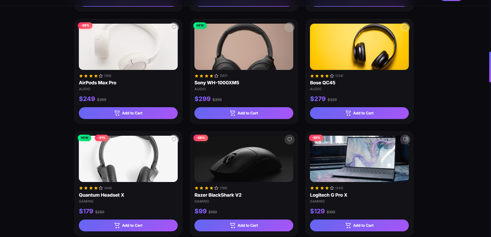

**Light Theme 2**
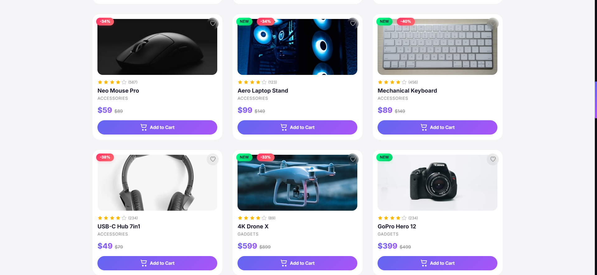

---

### Hot Deals
**Dark Theme**
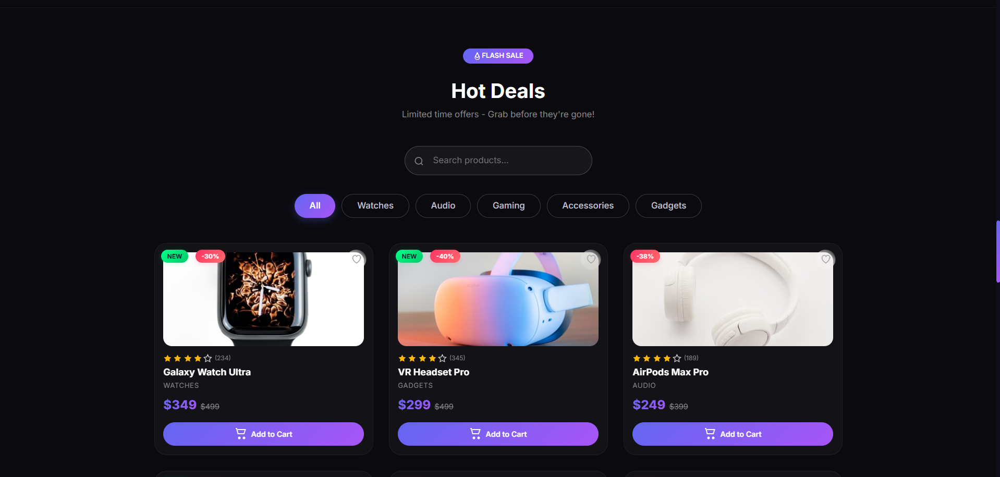

**Light Theme**
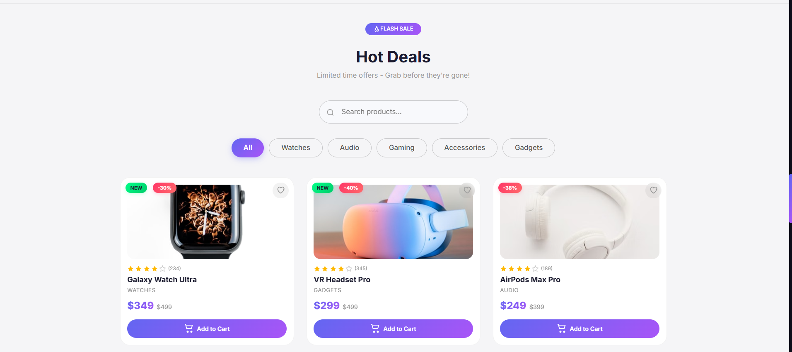

---

### Testimonials
**Dark Theme**
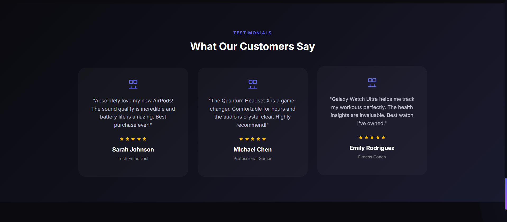

**Light Theme**
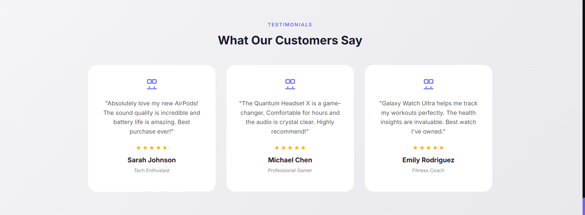

---

### Why Choose Us
**Dark Theme**
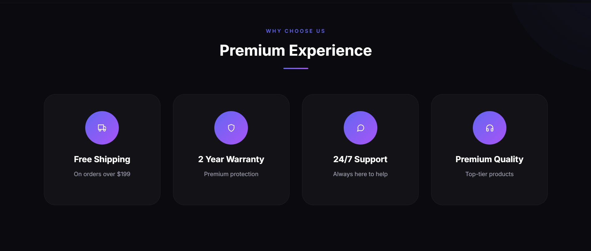

**Light Theme**
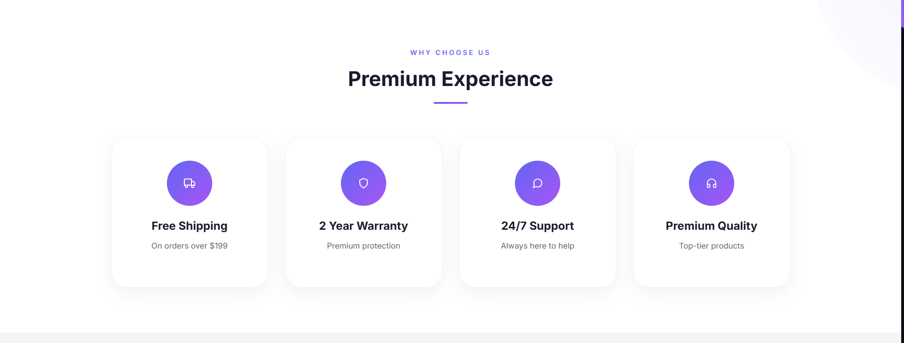

---

### Cart
**Dark Theme**
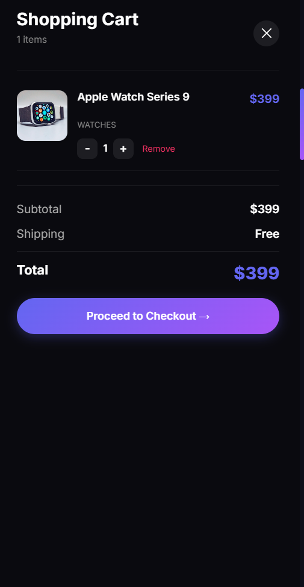

**Light Theme**
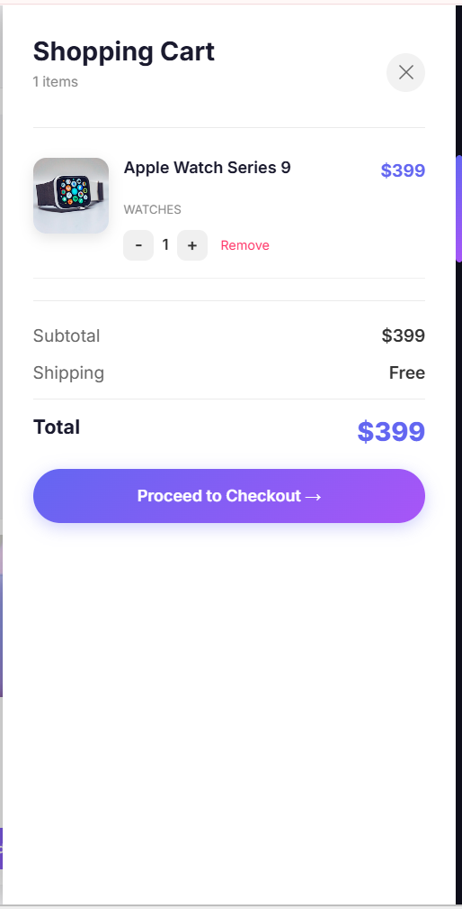
## Features

### 🛍️ E-Commerce Core
- Product listing with 15+ products across 6 categories
- Add to cart with quantity management
- Remove from cart with quantity controls
- Wishlist functionality (save favorite products)
- Cart drawer with real-time price calculation
- Local storage persistence (cart, wishlist, theme)

### 🔍 Search & Filter
- Real-time product search by name
- Category filters (All, Watches, Audio, Gaming, Accessories, Gadgets)
- Hot Deals section (automatically shows products with 30%+ discount)

### 🎨 UI/UX
- Glassmorphism design with backdrop blur
- Dark/Light mode toggle (persists in localStorage)
- Fully responsive (mobile, tablet, desktop)
- Smooth animations (scroll reveal, hover effects, card lift)
- Custom animated cursor
- Back to top button
- Toast notifications for order success

### 💳 Checkout
- Checkout form with validation (name, email, address)
- Auto-generated order ID
- Success modal with order confirmation
- Cart automatically clears after order

---

## 🛠️ Tech Stack

| Technology | Purpose |
|------------|---------|
| React 19 | Frontend framework |
| Vite | Build tool |
| JavaScript (ES6+) | Core logic |
| CSS3 | Styling & animations |
| LocalStorage | Data persistence |
| Framer Motion | Custom cursor animations |

---

## 📁 Project Structure
# TechNest Store
```
tech-nest-store/
├── src/
│ ├── components/
│ │ ├── Navbar.jsx # Sticky navigation bar
│ │ ├── Hero.jsx # Hero section with animated stats
│ │ ├── Features.jsx # Features section
│ │ ├── ProductCard.jsx # Individual product card
│ │ ├── ProductList.jsx # Product grid with filters
│ │ ├── Testimonials.jsx # Customer reviews
│ │ ├── Newsletter.jsx # Email subscription
│ │ ├── Footer.jsx # Footer with social links
│ │ ├── CartDrawer.jsx # Shopping cart drawer
│ │ ├── CustomCursor.jsx # Animated cursor
│ │ ├── FloatingShapes.jsx # Animated background shapes
│ │ └── Icons.jsx # All SVG icons
│ ├── data/
│ │ └── products.js # Product data
│ ├── App.jsx # Main application
│ ├── main.jsx # Entry point
│ └── index.css # Global styles
├── index.html
├── package.json
└── README.md
```
---

## 🚀 Installation

```bash
# Clone the repository
git clone https://github.com/Sara12-2/TechNest_Ecommerce_Website

# Navigate to project
cd TechNest-Ecommerce

# Install dependencies
npm install

# Start development server
npm run dev

# Open browser at http://localhost:5173

----

## 📱 Usage
```
### 🛒 Cart System
- Browse products on Best Sellers section  
- Click "Add to Cart" on any product  
- Cart count updates in navbar  

### 🧺 Managing Cart
- Open cart from navbar  
- Increase / decrease quantity  
- Remove items  
- Proceed to checkout  

### 💳 Checkout
- Fill name, email, address  
- Click Place Order  
- Order confirmation appears  
- Cart clears automatically  

### ❤️ Wishlist
- Click heart icon  
- Toggle to remove  

### 🌙 Dark/Light Mode
- Toggle from navbar  
- Saved in localStorage  
```
---

## 🧩 Components
```
| Component | Description |
|----------|-------------|
| Navbar | Sticky navigation + cart + theme toggle |
| Hero | Animated landing section |
| ProductCard | Product UI with badges |
| ProductList | Search + filter system |
| CartDrawer | Checkout system |
| Features | Feature highlights |
| Newsletter | Email subscription |
| Footer | Links + contact info |
```
---

## 🎨 Customization
```
### ➕ Add Product
```javascript
{
  id: 18,
  name: "Product Name",
  price: 99,
  oldPrice: 149,
  category: "Category",
  image: "image-url",
  rating: 4.5,
  reviews: 100,
  isNew: true,
  discount: 30
}
```

## 🎨 Change Theme Colors

```css
.gradient-primary {
  background: linear-gradient(135deg, #6366f1, #a855f7);
}
```
## 👩‍💻 Author

Sara Manzoor  
GitHub: @Sara12-2  
LinkedIn: Sara Manzoor  
Email: saramanzoor76@gmail.com  
LinkedIn profile : https://www.linkedin.com/in/sara-manzoor-3a8a56365?utm_source=share_via&utm_content=profile&utm_medium=member_android

---

## 📄 License

MIT License – free to use and modify.

---

## ⭐ Support

If you like this project, give it a ⭐ on GitHub  

---

Built with ❤️ by Sara Manzoor
